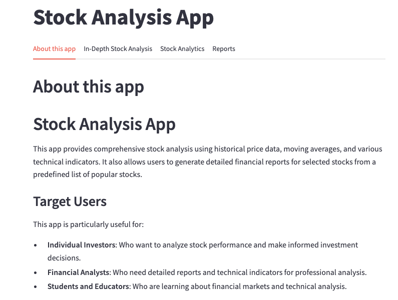
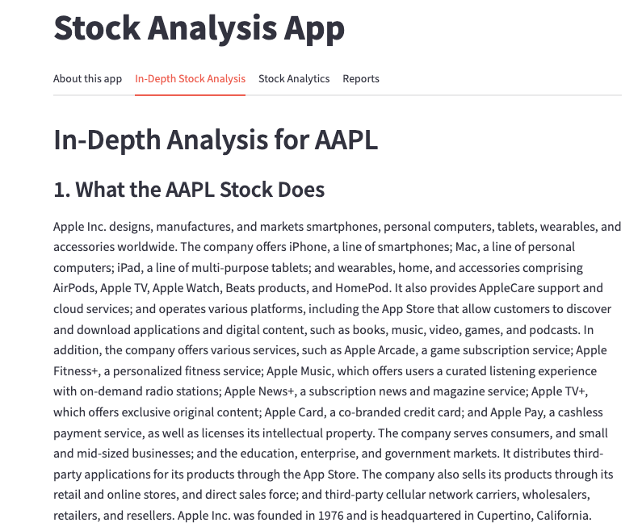
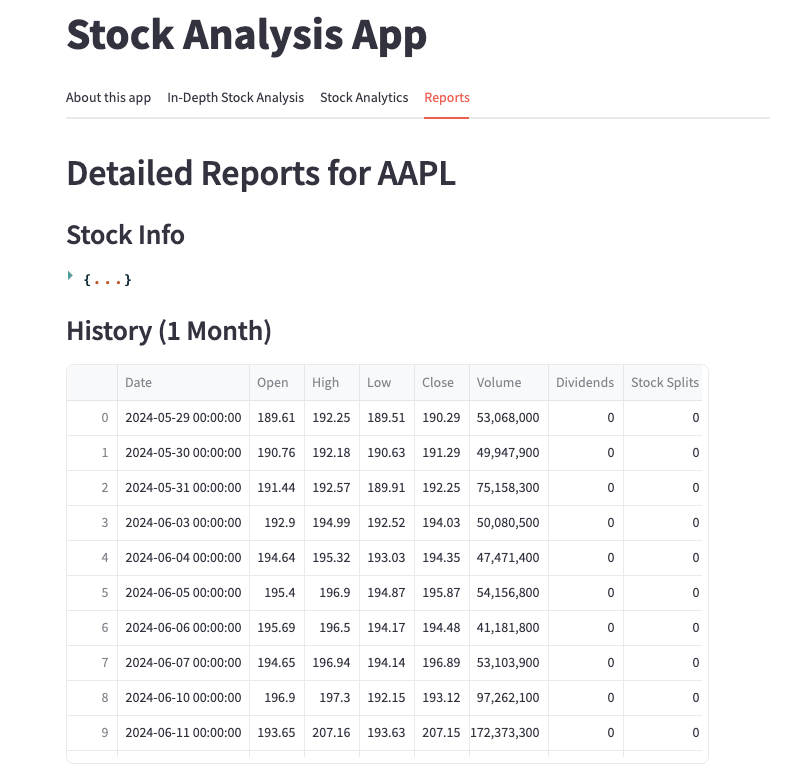

# Stock Analysis App

 

## Overview

The Stock Analysis App provides comprehensive stock analysis using historical price data, moving averages, and various technical indicators. It also allows users to generate detailed financial reports for selected stocks from a predefined list of popular stocks.

## Features

- **Stock Analysis**: Analyze stock performance with moving averages, trading volume, RSI, and MACD.
- **In-Depth Stock Analysis**: Detailed information on business summary, P/E ratio, beta, dividend rate, and historical performance.
- **Reports**: Generate and download comprehensive financial reports in Excel format.

## Target Users

This app is particularly useful for:
- **Individual Investors**: Who want to analyze stock performance and make informed investment decisions.
- **Financial Analysts**: Who need detailed reports and technical indicators for professional analysis.
- **Students and Educators**: Who are learning about financial markets and technical analysis.

## Instruction Manual

### Getting Started

1. **Launching the App**: 
   - Ensure you have Python and Streamlit installed.
   - Run the app using the command: 
     ```sh
     streamlit run script_name.py
     ```

2. **Navigating the Interface**: 
   - The app interface is divided into four main tabs accessible at the top of the app:
     - **Stock Analysis**: General stock analysis with various metrics.
     - **In-Depth Stock Analysis**: Detailed stock information and historical performance.
     - **Reports**: Generate and download comprehensive financial reports.
     - **About this app**: Information about the app.

### Using the "Stock Analysis" Tab

1. **Select Stock Symbol**: Choose a stock symbol from the dropdown list on the sidebar.
2. **Select Analysis Metrics**: Choose the metrics you want to analyze from the options provided:
   - Prices and Moving Averages
   - Trading Volume
   - RSI (Relative Strength Index)
   - MACD (Moving Average Convergence Divergence)
3. **View Analysis**: The selected metrics will be displayed as interactive Plotly charts. Detailed explanations for each metric will be shown below the charts.

### Using the "In-Depth Stock Analysis" Tab

1. **Select Stock Symbol for In-Depth Analysis**: Choose a stock symbol from the dropdown list on the sidebar.
2. **View In-Depth Analysis**: The app will display detailed information about the stock, including:
   - Business summary
   - Price-to-Earnings (P/E) ratio
   - Beta (volatility)
   - Dividend rate
   - Detailed stock chart for the past year.

### Using the "Reports" Tab

1. **Select Stock Symbol for Detailed Reports**: Choose a stock symbol from the dropdown list on the sidebar.
2. **Generate and View Report**: The app will generate a detailed financial report for the selected stock. Various sections of the report will be displayed, including stock history, financial statements, holders, and insider transactions.
3. **Download Report**: A button will be provided to download the report as an Excel file.

## Example Screenshots





## Installation

1. Clone the repository:
   ```sh
   git clone https://github.com/yourusername/stock-analysis-app.git

2. Install the required pacakges: 
   ```sh
   pip install -r requirements.txt

3. Run the app:
   ```sh
   streamlit run app.py

## Contributing
Contributions are welcome! Please fork the repository and create a pull request with your changes.
